> **🚀 Get the tool:** [github.com/f0rw4rd/tls-preloader](https://github.com/f0rw4rd/tls-preloader)
> 
> A universal TLS certificate bypass tool supporting OpenSSL, GnuTLS, NSS, mbedTLS, and wolfSSL - all with a single LD_PRELOAD!
{: .prompt-info }

When conducting security research on embedded devices and industrial applications, researchers frequently encounter a common obstacle: TLS certificate validation. Many embedded applications are built using OpenSSL or similar libraries with properly implemented certificate verification. While this is excellent from a security perspective, it presents challenges during legitimate research activities when attempting to analyze network traffic.

The typical scenario involves receiving `CERTIFICATE_VERIFY_FAILED` errors when attempting to intercept and analyze application traffic. This occurs because the application correctly validates the certificate chain and rejects any certificates that don't match its expectations.

Traditional approaches to this problem include:
- **Binary patching** - Requires deep knowledge of the specific TLS library implementation and some time
- **Dynamic instrumentation (Frida)** - Powerful but requires writing JavaScript hooks for each target application and library, also Frida does not work well with musl libc user spaces
- **Certificate infrastructure setup** - Time-consuming process of creating CA certificates, and some embedded systems have read-only CA files 
- **Source code modification** - Only viable when source code is available, which is rarely the case for proprietary applications

## Solution: Dynamic Library Interposition with LD_PRELOAD

The [**tls-preloader**](https://github.com/f0rw4rd/tls-preloader) tool provides an elegant solution to this problem by leveraging the `LD_PRELOAD` mechanism available on Linux and Unix systems. This approach allows dynamic interception of library function calls without modifying the target application or its libraries.

### How Linux Dynamic Linking Works

When a program starts on Linux, the dynamic linker (`ld.so`) is responsible for loading all required shared libraries and resolving function symbols. Here's how the process works:


The **key insight**: When `LD_PRELOAD` is set, those libraries are loaded *before* the standard system libraries. Since the dynamic linker uses the first symbol it finds, our interceptor functions take precedence over the original ones.

### Technical Implementation

```bash
LD_PRELOAD=/tmp/libtlsnoverify.so your_app
```

The tool works by interposing certificate verification functions and returning success values, effectively bypassing validation checks. This approach eliminates the need for binary patching, recompilation, or complex certificate infrastructure.

### Understanding Symbol Resolution with LD_DEBUG

The dynamic linker provides powerful debugging capabilities through the `LD_DEBUG` environment variable. This is invaluable for understanding which functions are being called from which libraries - especially useful in complex systems with custom crypto implementations.

```bash
# See all symbol bindings - great for finding crypto functions
LD_DEBUG=bindings curl https://example.com 2>&1 | grep -i verify

# Example output showing OpenSSL symbol resolution:
#  31795: binding file /usr/lib/libssl.so.3 [0] to /usr/lib/libcrypto.so.3 [0]: normal symbol `X509_verify_cert' [OPENSSL_3.0.0]
#  31795: binding file /usr/lib/libssl.so.3 [0] to /usr/lib/libcrypto.so.3 [0]: normal symbol `X509_VERIFY_PARAM_set1_ip' [OPENSSL_3.0.0]
```

Other useful `LD_DEBUG` options for security research:

```bash
# Show library loading order
LD_DEBUG=libs ./target_app

# See all symbol lookups (verbose!)
LD_DEBUG=symbols ./target_app

# Track library initialization
LD_DEBUG=init ./target_app

# Everything at once (prepare for data overload)
LD_DEBUG=all ./target_app 2>&1 | less
```

### libc Dependencies and Variations

The behavior of `LD_PRELOAD` and `LD_DEBUG` can vary between different libc implementations:

- **glibc** (GNU C Library) - Full featured, supports all `LD_DEBUG` options
- **musl libc** - Lightweight, limited `LD_DEBUG` support (only `LD_DEBUG=1` for basic output)
- **uClibc** - Embedded systems, basic `LD_PRELOAD` support but minimal debugging

### Supported TLS Libraries

The tool supports multiple TLS implementations commonly found in embedded and industrial applications:

- **OpenSSL/BoringSSL** - The most widely deployed TLS library
- **GnuTLS** - GNU Transport Layer Security library
- **NSS** - Network Security Services (Mozilla)
- **mbedTLS** - Lightweight TLS implementation for embedded systems
- **wolfSSL** - Embedded SSL/TLS library
- **libcurl** - HTTP library with built-in certificate validation 

## Practical Applications

The tool has several legitimate use cases in security research and development:

- **Security assessments** - Analyzing network traffic during penetration testing engagements
- **Legacy application debugging** - Troubleshooting industrial control systems and SCADA applications
- **IoT device analysis** - Intercepting communications from embedded devices for security evaluation
- **Development and testing** - Simplifying certificate management in test environments

## Installation

```bash
git clone https://github.com/f0rw4rd/tls-preloader
cd tls-preloader
make
LD_PRELOAD=./libtlsnoverify.so curl https://expired.badssl.com
```

### Technical Details: Intercepted Functions

The tool intercepts the following certificate verification functions:
- **OpenSSL**: `SSL_CTX_set_verify`, `X509_verify_cert`, and related validation functions
- **GnuTLS**: `gnutls_certificate_verify_peers2`, `gnutls_certificate_verify_peers3`
- **NSS**: `CERT_VerifyCertificate` and related NSS verification APIs
- **curl**: `CURLOPT_SSL_VERIFYPEER`, `CURLOPT_SSL_VERIFYHOST` options
- Additional library-specific verification functions

### Known Limitations

The tool has several limitations that users should be aware of:

- **Statically linked applications** - Cannot intercept functions in statically linked binaries
- **Rust applications using rustls** - The rustls library is typically statically linked
- **Go programs** - Go's native TLS implementation is not based on dynamic libraries
- **Chrome/Chromium** - Ships with a bundled, statically linked BoringSSL implementation 
- **High Level Language** - C# and Java have high level implementations or some high level checks that can not be overloaded

## Example Commands

```bash
# Basic usage - just make it work
LD_PRELOAD=/tmp/libtlsnoverify.so wget https://self-signed.badssl.com

# Debug mode - see what's being bypassed
TLS_NOVERIFY_DEBUG=1 LD_PRELOAD=/tmp/libtlsnoverify.so curl https://expired.badssl.com

# Backtrace mode - for when you really want to know what's happening
TLS_NOVERIFY_BACKTRACE=1 LD_PRELOAD=/tmp/libtlsnoverify.so curl https://expired.badssl.com

# The "let's break Firefox" special
TLS_NOVERIFY_BACKTRACE=1 LD_PRELOAD=/tmp/libtlsnoverify.so firefox https://badssl.com/dashboard/
```

## Get Started with tls-preloader

Ready to bypass TLS validation for your security research? Check out the full source code and documentation:

> **[→ github.com/f0rw4rd/tls-preloader](https://github.com/f0rw4rd/tls-preloader)**
{: .prompt-tip }

### Case Study: Firefox and BadSSL.com

The following example demonstrates the tool's effectiveness when used with Firefox browser accessing the BadSSL.com test suite:

```bash
$ TLS_NOVERIFY_BACKTRACE=1 LD_PRELOAD=/tmp/libtlsnoverify.so firefox https://badssl.com/dashboard/
```


The backtrace shows the tool successfully intercepting Firefox's NSS library calls. Each certificate validation attempt is logged and bypassed.


The BadSSL.com dashboard, which is designed to test certificate validation, shows all test cases in red - indicating that the browser successfully connected to hosts with bad certificates. This is the expected behavior when using tls-preloader, as it bypasses all certificate validation checks. The tool effectively disables protection against expired certificates, self-signed certificates, hostname mismatches, and other TLS security issues that BadSSL.com tests for.

## Bonus: Why LD_PRELOAD Doesn't Work on sudo

Ever wondered why you can't just `LD_PRELOAD` sudo? Check this out:

```bash
# Try to preload a library with sudo using absolute path
$ strace -E LD_PRELOAD="/tmp/raccoon.so" -e openat sudo 2>&1 | grep raccoon
# No output - LD_PRELOAD with absolute path completely ignored!

# But wait, what about relative paths?
$ strace -E LD_PRELOAD="raccoon.so" -e openat sudo 2>&1 | grep raccoon
openat(AT_FDCWD, "/usr/lib/sudo/glibc-hwcaps/x86-64-v3/raccoon.so", O_RDONLY|O_CLOEXEC) = -1 ENOENT
openat(AT_FDCWD, "/usr/lib/sudo/glibc-hwcaps/x86-64-v2/raccoon.so", O_RDONLY|O_CLOEXEC) = -1 ENOENT
openat(AT_FDCWD, "/usr/lib/sudo/raccoon.so", O_RDONLY|O_CLOEXEC) = -1 ENOENT
openat(AT_FDCWD, "/usr/lib/glibc-hwcaps/x86-64-v3/raccoon.so", O_RDONLY|O_CLOEXEC) = -1 ENOENT
openat(AT_FDCWD, "/usr/lib/glibc-hwcaps/x86-64-v2/raccoon.so", O_RDONLY|O_CLOEXEC) = -1 ENOENT
openat(AT_FDCWD, "/usr/lib/raccoon.so", O_RDONLY|O_CLOEXEC) = -1 ENOENT
# Interesting! It searches in secure paths only

# Same library with regular id command  
$ strace -E LD_PRELOAD="/tmp/raccoon.so" -e openat id 2>&1 | grep raccoon
openat(AT_FDCWD, "/tmp/raccoon.so", O_RDONLY|O_CLOEXEC) = -1 ENOENT
# Dynamic linker loads from anywhere for non-setuid binaries!
```

The key difference: **setuid binaries only search secure system paths** (`/usr/lib`, `/lib`) for relative LD_PRELOAD libraries, while completely ignoring absolute paths containing `/`. This prevents loading untrusted libraries from user-writable locations like `/tmp`.

**Note**: If you have root access to copy your library to `/usr/lib`, then `LD_PRELOAD="libtlsnoverify.so"` would actually work with sudo.

```bash
sudo cp libtlsnoverify.so /usr/lib/
sudo chmod u+s /usr/lib/libtlsnoverify.so  # Needs setuid bit! (only needed for LD_PRELOAD and not DT_NEEDED)
sudo chown root:root /usr/lib/libtlsnoverify.so  # Proper ownership
```

### The AT_SECURE Protection

When executing binaries that change privileges, the kernel sets `AT_SECURE=1`, causing the dynamic linker to ignore most `LD_*` environment variables:

**AT_SECURE=1** triggers when **gaining privileges via**:
- ✅ setuid/setgid binaries owned by different user
- ✅ File capabilities (CAP_NET_RAW, CAP_NET_BIND_SERVICE, etc.)
- ✅ Ambient capabilities that grant new privileges
- ❌ Regular binaries without privilege changes

### Impact on tls-preloader

Our tool works normally on most applications but can't intercept:
- System utilities like `sudo`, `passwd`, `ping`
- Setgid programs accessing restricted resources
- Any binary that elevates privileges

This is a security feature, not a bug! Here's how the security model works:

```mermaid
%%{init: {'theme':'dark'}}%%
graph TD
    A[setuid/setgid binary executes] --> B[Kernel sets AT_SECURE=1]
    B --> C[Dynamic linker checks AT_SECURE]
    C --> D{Security restrictions}
    
    D --> E[LD_PRELOAD restrictions:<br/>• Absolute paths ignored<br/>• Only system paths searched<br/>• Library must be setuid]
    D --> F[LD_LIBRARY_PATH ignored]
    D --> G[Other LD_* vars sanitized]
    
    E --> H{Library location check}
    H -->|User path<br/>/tmp, /home| I[❌ Rejected]
    H -->|System path<br/>/usr/lib, /lib| J{Ownership check}
    
    J -->|Not root owned| I
    J -->|Root owned + setuid| K[✅ Library loaded]
    
    K --> L[Symbol interposition works]
    L --> M[Functions intercepted]
    
    style A fill:#444,stroke:#fff,color:#fff
    style B fill:#ff6666,stroke:#fff,stroke-width:2px,color:#000
    style D fill:#ff6666,stroke:#fff,stroke-width:2px,color:#000
    style E fill:#ffcc66,stroke:#fff,stroke-width:2px,color:#000
    style I fill:#ff6666,stroke:#fff,stroke-width:2px,color:#000
    style K fill:#66ff66,stroke:#fff,stroke-width:2px,color:#000
```



---