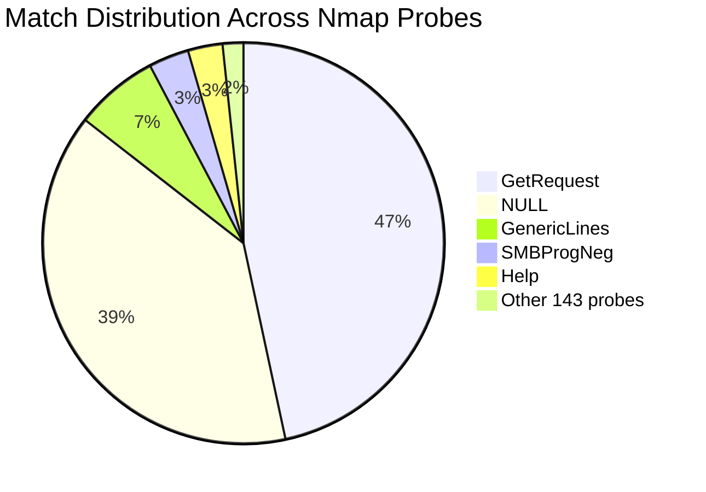

> **TL;DR:** Nmap remains valuable for OT scanning but has limitations with modern secure protocols. This post covers custom service probes for KNX and OPC UA, essential NSE scripts, troubleshooting commands, and when to choose Nmap versus specialized tools. Key takeaway: for basic port discovery and common protocols (Modbus, S7, BACnet), Nmap excels; for complex OT protocols, use dedicated tools.

Active scans are a heavily discussed topic in OT, especially in productive networks, but they're needed to identify assets or more specifically to test the open ports of assets. The OT community remains divided on this - while some argue that active scans should never be used in production environments, others like Langner argue that ["OT asset discovery without active probing isn't OT asset discovery"](https://www.langner.com/ot-ics-asset-discovery/). The reality lies somewhere in between: controlled, targeted scanning with proper safeguards.

In my opinion, some protocols like **SNMP** and **HTTP** are safe to use most of the time. But generic service probing on unknown OT assets in use? That's like walking through a minefield. Therefore, you need a tool which can be trusted and is granular in its payload selection. In my opinion, the old reliable **Nmap** is well-suited for this - however, the support of OT protocols is not that great.

## The OT Protocol Jungle

In OT, there seems to be an infinite amount of protocols across industries, vendors, and products. For example, within SCADA systems you often see very product-specific protocols that are used nowhere else. That's an example where custom protocol detection is not that useful because reusability is low. However, vendor-agnostic tools are a good thing to have.

**Nmap**, at the time of writing, is 27 years old and written by Gordon "Fyodor" Lyon (thanks!) and is still a good and essential tool for port scanning, service detection, and much more. For OT security research, it's good to know how to adapt the scanner to your needs.

## Port Scanning

Port scanning itself is often less dangerous than people think - if done correctly. The key is being deliberate: use connect scans (`-sT`) instead of SYN scans, slow down your timing (`-T2` or lower), and target specific ports rather than full ranges. The risks are twofold: overwhelming resource-constrained devices with too many packets too quickly, and the fact that some OT components simply don't expect TCP connections. They might block when someone connects without proper handshakes, hold connections open indefinitely, or just crash when receiving unexpected traffic on certain ports.

A connect scan completes the full TCP handshake:

```
Client                                          Server
  |                                               |
  |------------- SYN (seq=x) ------------------>  |
  |                                               |
  |<------------ SYN-ACK (seq=y, ack=x+1) -----   |
  |                                               |
  |------------- ACK (seq=x+1, ack=y+1) ------>   |
  |                                               |
  |                CONNECTION ESTABLISHED         |
  |                                               |
  |------------- FIN or RST ------------------>   |
  |                                               |
  |                CONNECTION ABORTED             |
```

A SYN scan abandons the connection halfway:

```
Scanner                                         Server
  |                                               |
  |------------- SYN (seq=x) ------------------>  |
  |                                               |
  |<------------ SYN-ACK (seq=y, ack=x+1) -----   |
  |                                               |
  |------------- RST (seq=x+1) --------------->   |
  |                                               |
  |        PORT MARKED OPEN (no connection)       |
```

While both scans send a RST packet, there's a critical difference. The connect scan properly establishes then terminates the connection. The SYN scan sends a bare RST after receiving SYN-ACK, which creates an RFC ambiguity. Many older TCP implementations don't trust this RST (it could be spoofed) and keep the connection in SYN_RECEIVED state for e.g. 30-75 seconds.
On resource-constrained devices with small connection tables, few hundred SYN scans can exhaust all available slots, preventing legitimate connections. Modern stacks implement SYN cookies to avoid this—they don't allocate resources until receiving a valid ACK with the correct sequence number. But many embedded devices lack this protection.

## OS Detection and Fingerprinting

While port scanning tells you what's open, OS detection attempts to identify what system you're dealing with or that TCP/IP stack is used. This is particularly valuable in OT environments where knowing whether you're facing a Windows HMI, a Linux gateway, or a proprietary RTOS can inform your security approach.

Nmap's OS detection combines multiple techniques:
* TCP Sequence Analysis: How predictable are the Initial Sequence Numbers?
* TCP Options Order: Different stacks arrange options differently
* ICMP Responses: Echo reply padding patterns and error message formats
* TCP Window Sizes: Initial window and scaling behavior
* IP TTL Values: Default starting TTL (64 for Linux, 128 for Windows)
* TCP Timestamp Behavior: Frequency and presence

```bash
# Siemens LOGO! 0BA7 (with ethernet connection)
Fingerprint Siemens LOGO! 0BA7 PLC
Class Siemens | embedded || specialized
# TCP seq predictability 0-5% (good), GCD values vary (good randomness), ISR=219-229 (high rate), TI/CI=incremental IDs (bad), II=random increments (good), not shared, no timestamps
SEQ(SP=0-5%GCD=1955895|32AB12A|4C009BF|6556254|7EABAE9%ISR=DB-E5%TI=I%CI=I%II=RI%SS=O%TS=U)         
# MSS=512 bytes (0x200) - very small, no other TCP options
OPS(O1=M200%O2=M200%O3=M200%O4=M200%O5=M200%O6=M200)                                               
 # Fixed 4KB window (0x1000) - no window scaling support 
WIN(W1=1000%W2=1000%W3=1000%W4=1000%W5=1000%W6=1000)                
# TTL 250-260 (0xFA-0x104), no ECN support, DF not set                               
ECN(R=Y%DF=N%T=FA-104%TG=FF%W=1000%O=M200%CC=N%Q=)   
# SYN probe: normal SYN+ACK response                                               
T1(R=Y%DF=N%T=FA-104%TG=FF%S=O%A=S+%F=AS%RD=0%Q=)                                                   
# NULL flags probe: no response (correct behavior)            
T2(R=N)                                                       
# Invalid flags combo: still sends SYN+ACK (ignores bad flags)                          
T3(R=Y%DF=N%T=FA-104%TG=FF%W=1000%S=O%A=S+%F=AS%O=M200%RD=0%Q=)   
# ACK to open port: ACK+RST (normal)                                  
T4(R=Y%DF=N%T=FA-104%TG=FF%W=1000%S=A+%A=S%F=AR%O=%RD=0%Q=)           
# SYN to closed port: ACK+RST (normal)                              
T5(R=Y%DF=N%T=FA-104%TG=FF%W=1000%S=A%A=S+%F=AR%O=%RD=0%Q=)             
# ACK to closed port: ACK+RST (normal)                            
T6(R=Y%DF=N%T=FA-104%TG=FF%W=1000%S=A%A=S%F=AR%O=%RD=0%Q=)        
# FIN+PSH+URG to closed: ACK+RST (normal)                                 
T7(R=Y%DF=N%T=FA-104%TG=FF%W=1000%S=A%A=S+%F=AR%O=%RD=0%Q=)                      
# UDP probe: ICMP unreachable, IPL=56 bytes (0x38), unused field has garbage (0x5987)                   
U1(DF=N%T=FA-104%TG=FF%IPL=38%UN=5987%RIPL=G%RID=G%RIPCK=G%RUCK=G%RUD=G)                            
# ICMP echo: copies DF bit and code field from request
IE(DFI=S%T=FA-104%TG=FF%CD=S) 
```

These create unique fingerprints—an industrial controller might show fixed 4KB windows, no TCP timestamps, and unpredictable sequence numbers. Unfortunately, the current `nmap-os-db` contains relatively few ICS device fingerprints.
Since ICS OS fingerprints are rare, the `--fuzzy` option helps find similar signatures that might match your device. This can for example help you find out if the stack is QNX or VxWorks or maybe something different. 

**Critical warning about OS detection behavior:** Even when using `-sT` (connect scan) for port scanning, the OS detection phase operates differently. It sends raw packets that may leave connections in unstable states. The detection probes target:
- Open ports found during scanning (preferred)
- If no open ports: the last few ports scanned
- As fallback: random high ports

The packet trace below demonstrates this behavior—notice how OS detection sends SYN packets without proper teardown, FIN+PSH+URG flag combinations, and ICMP probes: 

```bash
sudo nmap -O -n -v -p1234 --packet-trace -Pn 1.1.1.1 -sT

# Phase 1: Connect scan - properly handled
CONN (0.0696s) TCP localhost > 1.1.1.1:1234 => Operation now in progress
Completed Connect Scan at 19:20, 2.01s elapsed (1 total ports)

# Phase 2: OS detection starts - aggressive probing begins!
Initiating OS detection (try #1) against 1.1.1.1

# Malformed ICMP: type=8/code=9 (should be code=0!)
SENT ICMP [Echo request (type=8/code=9)] IP [ttl=42]              

# Normal ICMP echo
SENT ICMP [Echo request (type=8/code=0)] IP [ttl=42]              

# UDP to random closed port 
SENT UDP 10.0.2.15:54140 > 1.1.1.1:38701 ttl=58                  

# TCP SYN with exotic options (win=31337, timestamp=MAX)
SENT TCP 10.0.2.15:65005 > 1.1.1.1:30400 S ttl=46 win=31337      

# Bare ACK without handshake
SENT TCP 10.0.2.15:65006 > 1.1.1.1:30400 A ttl=47 win=32768      

# FIN+PSH+URG combo - dangerous for embedded stacks!
SENT TCP 10.0.2.15:65007 > 1.1.1.1:30400 FPU ttl=53 win=65535    

# Pattern repeats with varying TTL (42→46→38→48→55→52)
# Each round fingerprints different stack behaviors
```

### Why This Matters for OT

OS detection's aggressive probing can be catastrophic for OT devices:

1. **Unusual flag combinations** (FIN+PSH+URG) may trigger undefined behavior in minimal TCP stacks
2. **Bare ACK packets** to closed ports can confuse state machines expecting proper handshakes
3. **Malformed ICMP codes** (type=8/code=9) violate RFC specifications and can crash primitive stacks
4. **No proper connection teardown** - probes are fire-and-forget, leaving devices in limbo states

For production OT networks, consider skipping OS detection for unknown production assets entirely (don't use the `-O` flag) unless absolutely needed. The information gained is often limited, and the risk to sensitive equipment is rarely worth it. 

## Service Probes - The Double-Edged Sword

Service probes are the most dangerous aspect of port scanning in OT environments. During a typical scan, Nmap sends up to ~101 TCP service probes and up to ~85 UDP service probes to identify what's running on open ports. Since OT networks often run custom or rare services that have never encountered such unexpected payloads, this can lead to undefined behavior or crashes. The consequences range from brief service restarts to complete system crashes, emergency halts, or even leaving devices in undefined states.

These are real stories that highlight the dangers of service probing in OT:

* **Printer Chaos**: Nmap excludes port 9100 for good reason - it's HP JetDirect. Not scanned by default. This protocol interprets anything sent to it as print jobs. One scan can trigger hundreds of printers to simultaneously print garbage pages, creating a vertical paper waterfall across the facility.
* **The Factory Reset Button**: A colleague discovered a large industrial printer with a factory reset service listening on a high port. Simply connecting to this port triggered a complete factory reset - no authentication, no confirmation, just instant configuration wipe.
* **Firmware Roulette**: During a pentest, a colleague sent an HTTP probe to an unknown high port. Turns out it was a firmware upgrade service that accepted the HTTP GET request as a "valid" firmware image and attempted to flash it, bricking the device (CVE-2024-35293). Shout out to David ;D

### Reducing Service Probe Risk

The problem is that many standard probes aren't relevant to OT - you're unlikely to encounter Quake game servers in industrial networks. You can significantly reduce risk by:

1. **Limiting probe sets**: Remove irrelevant probes from `nmap-service-probes`
2. **Using NULL probes**: For TCP, often just connecting without sending data triggers identification
3. **Focusing on essentials**: ~73% of service matches can be triggered with just three probes:
   * **NULL** - Connect without sending data
   * **GetRequest** - Simple HTTP GET
   * **GenericLines** - Just `\r\n\r\n`



## Custom Service Probes

While Nmap's default probes can be risky, creating your own targeted probes for specific OT protocols gives you control over what gets sent to your devices. Custom service probes are simple regex patterns that send specific byte sequences and parse responses to identify protocols and extract version information - essential when port 102 could be S7 Comm, MMS, or something entirely different.

### Current OT Protocol Coverage in Nmap

I analyzed the latest `nmap-service-probes` file (August 2025) for ICS/OT protocol coverage. Out of ~280 ICS-related keywords tested, Nmap detected **84 protocols and vendors** with the following notable coverage:

**Supported Protocols & Vendors:**
- **Modbus**: 16 matches including Schneider Modbus Bridge detection
- **Siemens**: 54 matches (SIMATIC, S7-200/300/1200, LOGO!, HiPath)
- **ABB**: 53 matches (robotics, automation systems)
- **Mitsubishi**: 8 matches (iQ-R, Q-series, MELSEC PLCs)
- **Allen-Bradley/Rockwell**: 4 matches (MicroLogix, ControlLogix)
- **Honeywell**: 5 matches (building systems, Vista ICM)
- **Schneider Electric**: 4 matches (Modbus bridge, web servers)
- **BACnet**: 1 match (building automation protocol)
- **CODESYS**: 1 match (SoftPLC detection)
- **OPC**: 17 matches (OPC servers, not OPC UA)
- **Beckhoff ADS**: 1 match 
- **PC WORX**: 1 match
- ....

The analysis shows Nmap has decent coverage for common protocols like Modbus and major vendors like Siemens/ABB, but lacks fingerprints for many critical infrastructure protocols and newer IIoT systems. This is where custom probes become essential.

### Creating Custom OT Service Probes

Since many OT protocols are missing from Nmap's default probes, you'll often need to create your own if want to have detection for the protocol. The good news is that service probes are relatively simple to write once you understand the protocol's handshake. 

## How Service Probes Work

To understand how to create your own probes, let's look at the anatomy of a service probe. Service probes in Nmap are defined in the `nmap-service-probes` file and follow a specific structure:

- **Probe directive**: Specifies the protocol (TCP/UDP) and the byte sequence to send
- **rarity**: How commonly this service is found (1-9, lower = more common)
- **ports/sslports**: Default ports where this service is typically found
- **match rules**: Regex patterns to identify responses and extract version information

Each probe sends a carefully crafted packet to trigger a response that can identify the service. The match rules then parse the response using regex patterns to determine the service type and extract details like version numbers or device names.

## Contributing New Service Probes

In [pull request #2730](https://github.com/nmap/nmap/pull/2730), I tried to contribute KNX and OPC UA service probes, which is still open in [pull request #2791](https://github.com/nmap/nmap/pull/2791) after combining similar contributions. Here's how they work and what I learned:

### KNX Service Probe

First, I analyzed KNX discovery with Wireshark to understand the normal communication flow. Typically, KNX devices expect the target IP address in the discovery packet. However, Nmap probes are static and can't include dynamic IP addresses. The clever workaround? Set the target IP to 0.0.0.0:0 (NAT IP and port), and it works! This allows scanning of both internet-facing and internal KNX devices.

The matching rule extracts the device's FriendlyName from the response. While it can't extract vendor information via MAC address, it reliably identifies KNX devices. The TCP probe differs from UDP by just one byte - the KNX header flag (byte 7): 0x01 for UDP, 0x02 for TCP.

**KNX Probe Definitions:**
```
# UDP probe for port 3671
Probe UDP KNX q|\x06\x10\x02\x03\x00\x0e\x08\x01\x00\x00\x00\x00\x00\x00|
rarity 7
ports 3671
match knxip m|^\x06\x10\x02\x04..\x36\x01\x02.....................([ -~]*)|s d/KNXnet-IP GW/ p/$1/

# TCP probe for port 3671  
Probe TCP KNX q|\x06\x10\x02\x03\x00\x0e\x08\x02\x00\x00\x00\x00\x00\x00|
rarity 7
ports 3671
match knxip m|^\x06\x10\x02\x04..\x36\x01\x02.....................([ -~]*)|s d/KNXnet-IP GW/ p/$1/
```

**Example output:**
```
Nmap scan report for 130.xxx.xxx.xx
Host is up (0.060s latency).

PORT     STATE SERVICE VERSION
3671/tcp open  knxip   IP Router Secure N 146
Service Info: Device: KNXnet-IP GW

Nmap scan report for 139.xxx.xxx.xx
Host is up (0.087s latency).

PORT     STATE SERVICE VERSION
3671/tcp open  knxip   bOS KNX Server
Service Info: Device: KNXnet-IP GW
```

### OPC UA Service Probe

The OPC UA probe sends a Hello message and checks whether the response is an ACK (acknowledgment) or ERR (error) message. I tested this on a local open62541 server and various public OPC UA servers ([public server list](https://github.com/node-opcua/node-opcua/wiki/publicly-available-OPC-UA-Servers-and-Clients)). 

While the probe reliably detects the OPC UA protocol, direct server version detection isn't possible due to the protocol's design - version information isn't exposed in the initial handshake.

**OPC UA Probe Definition:**
```
Probe TCP OPCUA q|HELF\x2e\x00\x00\x00\x00\x00\x00\x00\x00\x00\x02\x00\x00\x00\x02\x00\x00\x00\x00\x40\x00\x80\x00\x00\x0e\x00\x00\x00opc.tcp://nmap|
rarity 7
ports 4840
sslports 4843
match opcua m|^ACKF\x1c\x00\x00\x00\x00\x00\x00\x00|s p/OPC UA Binary Connection Protocol/
match opcua m|^ERRF..\x00\x00(....)..\x00\x00([ -~]*)|s p/OPC UA Binary Connection Protocol/ i/Error $I(1, "<") $2/
```

The OPC UA probe sends "HELF" (Hello Frame) followed by the connection URL. The match rules look for either "ACKF" (Acknowledge Frame) or "ERRF" (Error Frame) responses.

**Example output:**
```
Nmap scan report for opcuaserver.com (173.183.147.103)
Host is up (0.042s latency).
Not shown: 8 filtered tcp ports (no-response)
Some closed ports may be reported as filtered due to --defeat-rst-ratelimit
PORT      STATE SERVICE VERSION
4840/tcp  open  opcua   OPC UA Binary Connection Protocol
48010/tcp open  opcua   OPC UA Binary Connection Protocol
```

You can also update `nmap-services` to define default port mappings for these protocols to improve scanning efficiency.

## Troubleshooting OT Protocol Detection

OT protocol probes have high rarity values (7-9) and won't run in default scans. Here are essential flags for OT scanning:

```bash
nmap -sV --version-intensity 9 <target>    # Include rare probes
nmap -sV --version-all <target>            # Force all probes
nmap -sV --version-trace <target>          # Debug probe/response exchanges
nmap --script-trace <target>               # Debug NSE script execution
nmap --packet-trace <target>               # Show all packets sent and received
nmap -d <target>                           # Increase debugging level
nmap -vvvvv <target>                       # Maximum verbosity
nmap -sV -sU -p U:47808,T:502,102 <target> # Scan specific OT TCP/UDP ports
nmap --reason <target>                     # Show why ports are open/closed/filtered
nmap --max-retries 1 <target>              # Reduce retries for fragile systems
nmap -r <target>                            # Scan ports sequentially for fragile targets
```

### Pro Tips

- **Custom probes first**: Test your custom service probes with `--datadir` to use a local `nmap-service-probes` file
- **Port specification**: Always specify known OT ports explicitly - don't rely on default port ranges
- **Timing templates**: Use `-T2` (polite) or lower for production OT networks
- **Script combinations**: Run `--script "modbus-* or s7-*"` to batch related scripts
- **UDP scanning**: Many OT protocols (BACnet, DNP3) use UDP - don't forget `-sU`
- **Understand results**: Use `--reason` to see why ports show as filtered (firewall rules vs. no response)
- **Embedded systems**: For OT jump servers or embedded devices, use a [statically linked nmap binary](https://github.com/f0rw4rd/sthenos-embedded-toolkit/blob/main/output/x86_64/nmap) - no dependencies needed


## Detection Methods: Service Probes vs NSE Scripts

Nmap offers two main approaches for custom protocol detection:

1. **Service Probes** - Simple, fast pattern matching defined in `nmap-service-probes`. Best for protocols with straightforward handshakes and static responses. Limited to basic regex matching and version extraction.

2. **NSE Scripts** - Full Lua scripting capabilities for complex protocol interactions. Can handle multi-step handshakes, conditional logic, and data processing. However, they require more overhead and are harder to develop.

For simple protocol identification, service probes are ideal. When you need stateful interactions or complex protocol negotiations, NSE scripts become necessary.

## Nmap Scripting Engine for OT

For more complex protocol/service detection and interactions, you can use the mighty Nmap Scripting Engine (NSE). Currently, Nmap supports the following OT-related scripts:

### Official Nmap Scripts

From the current Nmap repository (revision 39269), the following OT-related scripts are officially included:
- **bacnet-info.nse** - BACnet device discovery (UDP Port 47808)
- **coap-resources.nse** - CoAP resources discovery (IoT/OT protocol)
- **enip-info.nse** - EtherNet/IP info (Port 44818)
- **fox-info.nse** - Niagara Fox protocol (Ports 1911, 4911)
- **hartip-info.nse** - HART-IP protocol (Port 5094)
- **iec-identify.nse** - IEC 60870-5-104 (Port 2404)
- **iec61850-mms.nse** - IEC 61850 MMS (Port 102)
- **knx-gateway-discover.nse** - KNX/EIBnet/IP gateway discovery (Port 3671)
- **knx-gateway-info.nse** - KNX/EIBnet/IP gateway information
- **modbus-discover.nse** - Modbus slave enumeration (Port 502)
- **mqtt-subscribe.nse** - MQTT broker discovery (IoT/OT messaging)
- **multicast-profinet-discovery.nse** - PROFINET DCP multicast discovery
- **omron-info.nse** - OMRON PLC information (Port 9600)
- **pcworx-info.nse** - Phoenix Contact PCWorx (Port 1962)
- **profinet-cm-lookup.nse** - PROFINET CM lookup
- **s7-info.nse** - Siemens S7 PLC information (Port 102)
- **dicom-brute.nse** - DICOM password brute force
- **dicom-ping.nse** - DICOM service detection


### A Note on Script Port Binding

Some scripts like `iec61850-mms.nse` don't rely on service probes but have hardcoded port rules. For example, this script only runs on port 102:

```lua
-- from iec61850-mms.nse
portrule = shortport.portnumber(102, "iso-tsap")
```

If you need to run such scripts on different ports, you'll need to either patch the script or use port redirection - there's no clean way around it. This is another limitation of NSE for flexible OT scanning.

### Third-Party Script Collections

Since official Nmap coverage is limited, several community repositories fill the gaps:

**[Digital Bond Redpoint](https://github.com/digitalbond/Redpoint)** - The original ICS/SCADA NSE scripts collection with scripts for BACnet, CODESYS v2, DNP3, EtherNet/IP, Fox, Modicon, Omron, PCWorx, ProConOS, and S7 enumeration.

**[ICS Protocol Detection Collection](https://github.com/cckuailong/ICS-Protocal-Detect-Nmap-Script)** - Comprehensive set covering Modicon (502), Crimson V3 (789), CODESYS v2 (1200/2455), Fox (1911), PCWorx (1962), CSPV4 (2222), IEC 60870-5-104 (2404), MELSEC-Q (5007), Omron (9600), ATG tanks (10001), DNP3 (20000), ProConOS (20547), EtherNet/IP (44818), and BACnet (47808).

**[DINA Community Scripts](https://github.com/DINA-community/ot-nmap-scripts)** - Added in Nmap 7.95 with HART-IP, IEC 61850 MMS, and PROFINET DCP/CM support.

## The Reality Check

While NSE is powerful, it struggles with modern OT protocols. The main issues: no proper debugger (just print statements), limited crypto support, and missing industrial protocol primitives like specialized CRC variants or ASN.1 parsing.

I learned this the hard way trying to implement OPC UA in NSE - hit a wall with X.509 certificates and security token negotiation. The increased security in OT products makes this worse. Take Siemens S7-Comm Plus with its custom crypto and later TLS migration - you're essentially reverse-engineering security mechanisms using a scripting language designed for simpler tasks.

So where is now the place for Nmap? **Nmap is still my number one for finding open ports and well-known OT protocols** like Modbus, KNX, OPC UA, and S7-Comm. However, for more complex protocols, custom tooling is often needed - and that's my cutoff line.

## Conclusion

Nmap remains an essential tool in the OT security arsenal, especially when you understand its capabilities, limitations and how to handle it in your environment. While it may not handle every obscure industrial protocol out there, its extensibility through custom service probes and scripts makes it valuable for reconnaissance in OT environments. Just remember - in production OT networks, every scan is a calculated risk. Choose your probes wisely, and when in doubt, stick to passive analysis or other non invasive methods.

The key is knowing when to use Nmap and when to reach for specialized OT scanning tools. For basic port discovery and common protocol identification, Nmap is unbeatable. For deep protocol interaction and complex handshakes? That's where dedicated tools shine.
